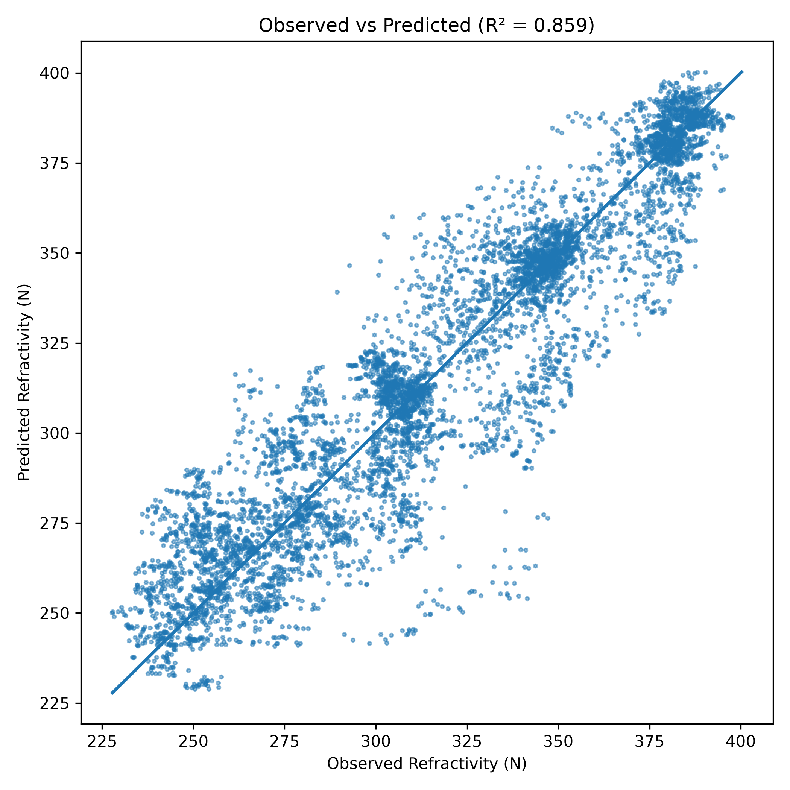
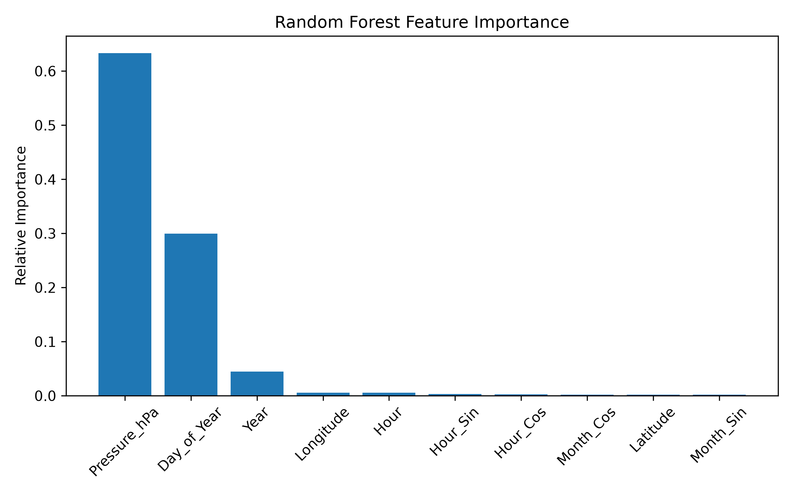
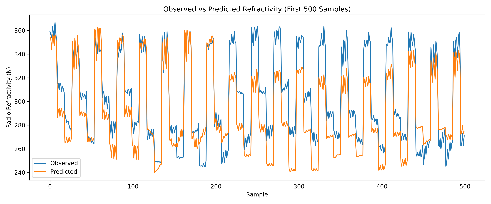
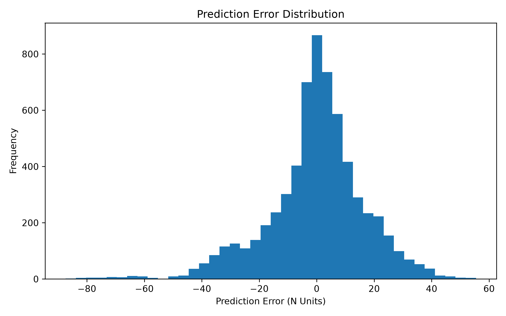
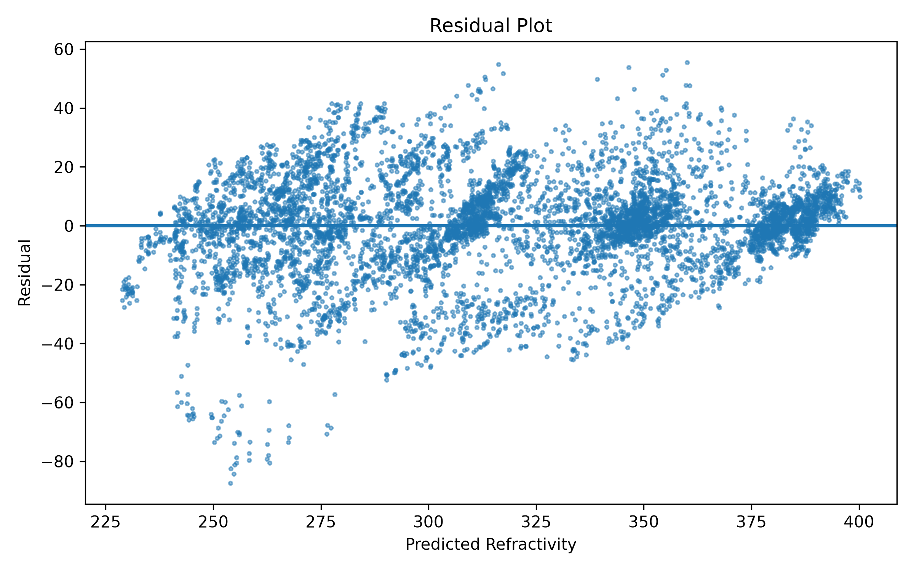
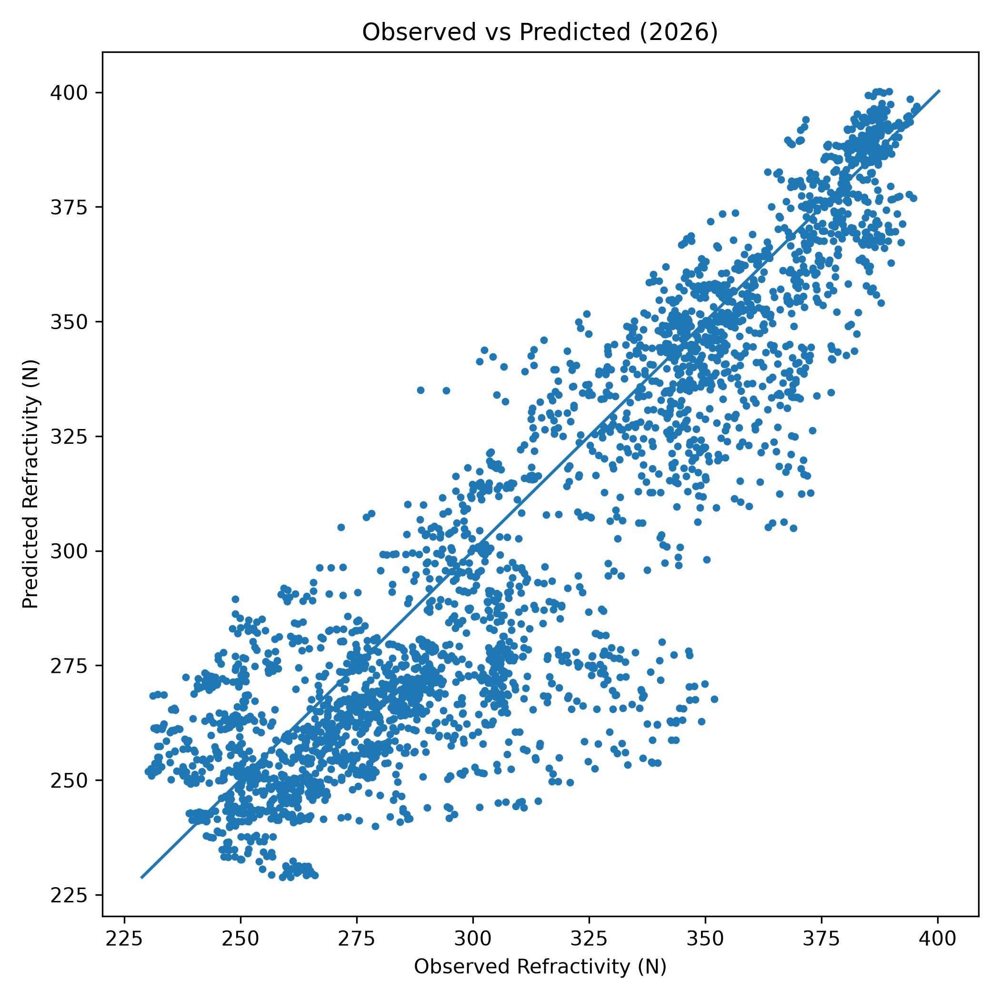
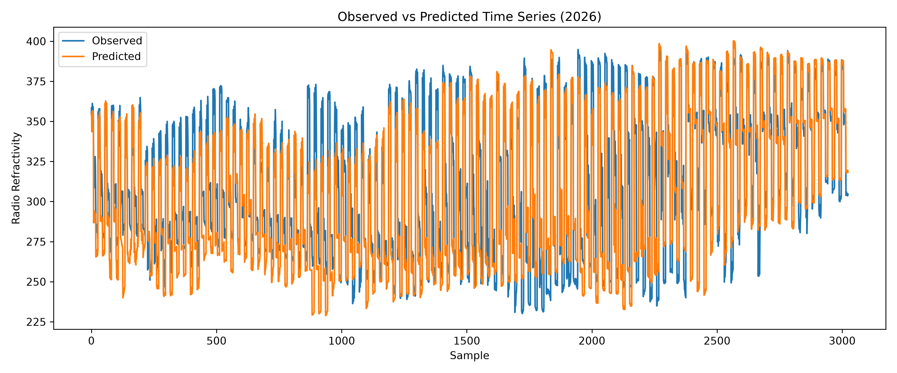

# EM Refractivity Prediction — Machine Learning Reconstruction of Radio Refractivity from ERA5 Reanalysis

A machine-learning pipeline that reconstructs atmospheric radio refractivity over the Mumbai coastal Arabian Sea from ERA5 pressure-level reanalysis data, trains a Random Forest regressor on historical refractivity, and validates the model against an independent, out-of-sample year.

<p align="center">
  
</p>

<p align="center">
  <em>Observed vs. predicted radio refractivity on the 2025 hold-out test set (R² = 0.859).</em>
</p>

---

## 1. Objectives

This project addresses three linked questions:

1. **Can radio refractivity be learned directly from ERA5 pressure-level fields**, without relying on a purely physics-based (bulk) reconstruction at every prediction step?
2. **Which atmospheric and temporal features drive refractivity variability** at a fixed coastal Arabian Sea location, and in what proportion?
3. **How well does a model trained on 2010–2024 generalise** — first to a held-out year (2025) drawn from the same source, and then to genuinely new, independently-processed data (2026)?

---

## 2. Study Region

| Parameter | Domain |
|---|---|
| Latitude | 18.75°N – 19.25°N |
| Longitude | 72.5°E – 73.0°E |
| Spatial resolution | 0.25° × 0.25° (3 × 3 grid) |
| Pressure levels | 850, 925, 1000 hPa |
| Training / testing record | 2010 – 2025 (hourly) |
| Independent validation record | 2026 (Jan – Jun, hourly) |

The domain sits off the Mumbai coast in the Arabian Sea, where strong thermal and moisture gradients in the lower troposphere drive significant short-term and seasonal variability in radio refractivity — relevant to maritime EM propagation, coastal radar, and RF link planning.

---

## 3. Methodology Overview

The pipeline runs as a sequential, script-per-stage workflow, from raw reanalysis data to a validated machine-learning model and an independent forward-prediction test.

**1. ERA5 data ingestion** — Hourly pressure-level ERA5 GRIB data (temperature, specific humidity, geopotential) is read and flattened into a tabular dataset.

**2. Physical target computation** — Radio refractivity is computed for every (time, pressure level, lat, lon) sample using the ITU-R P.453 formulation, forming the machine-learning target.

**3. Feature engineering** — Calendar and cyclical time features (day-of-year, sine/cosine encodings of month and hour, season) are derived to let the model learn seasonal and diurnal structure without discontinuities at year/day boundaries.

**4. Model training** — A Random Forest Regressor is trained on 2010–2024 data to predict radio refractivity from pressure, position, and time features.

**5. In-sample validation** — The trained model is evaluated on a held-out year (2025) from the same processed dataset, with full residual and error diagnostics.

**6. Independent 2026 dataset construction** — A separate ERA5 GRIB extract for 2026 is processed through the identical ingestion and feature pipeline, kept fully independent of model training.

**7. Forward prediction and external validation** — The trained model predicts refractivity for 2026, and its accuracy is assessed against the physically-computed 2026 refractivity — a genuine generalisation test on unseen conditions.

---

## 4. ERA5 Input Data

Hourly ERA5 pressure-level reanalysis data, provided by the Copernicus Climate Change Service and ECMWF.

| Variable | ERA5 short name | Role in the model |
|---|---|---|
| Temperature | `t` | Thermodynamic state at each pressure level |
| Specific humidity | `q` | Moisture content used to derive vapour pressure |
| Geopotential | `z` | Converted to geometric height above the surface |

Two GRIB extracts are used:

- `Data/ERA5.grib` — 2010–2025 training/testing record
- `Data/ERA5_2026.grib` — independent 2026 record, used only for external validation

---

## 5. Radio Refractivity Target

Each ERA5 sample is converted into radio refractivity using the **ITU-R P.453** formulation:

```
N = 77.6 (P/T) + 3.73×10⁵ (e/T²)
```

where `P` is pressure (hPa), `T` is temperature (K), and `e` is water vapour pressure (hPa), computed from specific humidity `q` as:

```
e = (q × P) / (0.622 + 0.378 q)
```

Geopotential `z` is converted to geometric height via `height = z / g` (g = 9.80665 m/s²) and retained as a derived field, though it is not used as a training feature (redundant with pressure level).

This physically-derived `N` is the regression target: the model learns to reconstruct it directly from time, position, and pressure — rather than from a full bulk surface-layer solve at inference time.

---

## 6. Feature Engineering

Raw calendar fields are transformed to avoid artificial discontinuities and to expose cyclical structure to the model:

- **Day_of_Year** — continuous seasonal position
- **Month_Sin / Month_Cos** — cyclical encoding of month (avoids the December→January discontinuity)
- **Hour_Sin / Hour_Cos** — cyclical encoding of hour-of-day (avoids the 23→0 discontinuity)
- **Season** — categorical Winter / Summer / Monsoon / Post-Monsoon label (descriptive; not used as a direct model input)
- **Feature correlation matrix** — computed across all numeric fields and saved for inspection

The final Random Forest **input feature set** is:

```
Year, Day_of_Year, Hour, Pressure_hPa, Latitude, Longitude,
Month_Sin, Month_Cos, Hour_Sin, Hour_Cos
```

**Target:** `Radio_Refractivity`

---

## 7. Model

**Algorithm:** Random Forest Regressor (scikit-learn)

| Hyperparameter | Value |
|---|---|
| `n_estimators` | 300 |
| `max_depth` | 20 |
| `min_samples_split` | 5 |
| `min_samples_leaf` | 2 |
| `random_state` | 42 |

**Train / test split:** temporal, not random — 2010–2024 for training, 2025 held out entirely for testing. This avoids leakage between adjacent hourly samples and gives a realistic estimate of forward-in-time predictive skill.

The trained model is serialised to `RandomForest_Model.pkl` for reuse in the 2026 prediction stage.

---

## 8. Results

### 8.1 Model performance — 2025 hold-out test set

| Metric | Value |
|---|---|
| MAE | 12.29 N-units |
| RMSE | 17.06 N-units |
| R² | 0.859 |
| Bias | −0.24 N-units |

The near-zero bias indicates no systematic over- or under-prediction; the model explains ~86% of the variance in radio refractivity from position, pressure, and time alone.

<p align="center">
  
  
</p>

### 8.2 Feature importance

| Feature | Relative importance |
|---|---|
| Pressure_hPa | 0.633 |
| Day_of_Year | 0.300 |
| Year | 0.045 |
| Longitude | 0.006 |
| Hour | 0.006 |
| Hour_Sin | 0.003 |
| Hour_Cos | 0.003 |
| Month_Cos | 0.002 |
| Latitude | 0.002 |
| Month_Sin | 0.002 |

**Pressure level and seasonal position (day-of-year) together account for over 93% of predictive importance** — consistent with the physical expectation that refractivity is dominated by the vertical thermodynamic profile and the seasonal monsoon–pre-monsoon humidity cycle, with a comparatively minor spatial signature across this small 0.25° domain.

### 8.3 Residual diagnostics (2025)

<p align="center">
  
</p>
<p align="center">
  
  
</p>

Errors are approximately centred on zero with no strong systematic trend against predicted magnitude, indicating the Random Forest has not developed a directional bias across the refractivity range.

### 8.4 Independent 2026 validation

The 2026 GRIB extract (January–June) is processed through an identical, independently-run pipeline and used purely as an out-of-sample forward test — the model never sees this data during training.

| Metric | Value |
|---|---|
| MAE | 16.39 N-units |
| RMSE | 22.04 N-units |
| R² | 0.776 |
| Bias | −9.03 N-units |
| Max error | +46.35 |
| Min error | −86.36 |

<p align="center">
  
  
</p>

**Performance degrades moderately relative to the 2025 hold-out** (R² 0.78 vs. 0.86, a persistent negative bias of ~9 N-units), which is expected for a purely statistical model extrapolating one to two years beyond its training window and across a partial-year (H1-only) sample. This gap is treated as a genuine limitation rather than smoothed over — see Section 10.

---

## 9. Repository Structure

```
EM_Refractivity_Prediction/
│
├── Data/
│   ├── ERA5.grib              ERA5 pressure-level data, 2010–2025 (training/testing)
│   └── ERA5_2026.grib         ERA5 pressure-level data, 2026 (independent validation)
│
├── Python_Codes/
│   ├── 01_ML_Dataset.py               GRIB → tabular dataset + refractivity target (2010–2025)
│   ├── 02_Feature_Engineering.py      Cyclical time features, season labels, correlation matrix
│   ├── 03_Train_RandomForest.py       Model training, 2025 hold-out test, feature importance
│   ├── 04_Model_Validation.py         Residual diagnostics on the 2025 test set
│   ├── 05_Create_2026_Dataset.py      GRIB → tabular dataset + refractivity target (2026)
│   ├── 06_Feature_Engineering_2026.py Feature engineering for the 2026 dataset
│   ├── 07_Predict_2026.py             Forward prediction using the trained model
│   └── 08_Validate_2026.py            External validation against physically-computed 2026 N
│
├── Results/
│   ├── ML_Dataset.csv                 Raw tabular dataset with refractivity (2010–2025)
│   ├── ML_Features.csv                Feature-engineered dataset (2010–2025)
│   ├── Feature_Correlation.csv        Full numeric feature correlation matrix
│   ├── Model_Performance.csv          2025 hold-out metrics
│   ├── Prediction_Results.csv         Per-sample 2025 predictions
│   ├── Feature_Importance.csv         Random Forest feature importances
│   ├── Validation_Metrics.csv         2025 residual-diagnostic metrics
│   ├── ML_Dataset_2026.csv            Raw tabular dataset with refractivity (2026)
│   ├── ML_Features_2026.csv           Feature-engineered dataset (2026)
│   ├── Predicted-2026.csv             Per-sample 2026 predictions
│   └── Validation_2026_Metrics.csv    2026 external validation metrics
│
└── Figures/
    ├── Predicted_vs_Observed.png              Training-stage scatter (2025 test)
    ├── Feature_Importance.png                 Random Forest feature ranking
    ├── Observed_vs_Predicted.png               Validation-stage scatter (2025 test)
    ├── Time_Series_Comparison.png              Observed vs predicted, first 500 samples (2025)
    ├── Prediction_Error_Histogram.png          Error distribution (2025)
    ├── Residual_Plot.png                       Residuals vs predicted value (2025)
    ├── Observed_vs_Predicted_2026.png          External validation scatter (2026)
    ├── Time_Series_2026.png                    Full observed vs predicted series (2026)
    ├── Prediction_Error_Histogram_2026.png     Error distribution (2026)
    └── Residual_Plot-2026.png                  Residuals vs predicted value (2026)
```

---

## 10. Limitations

- ERA5 provides a modelled atmospheric state, not direct local observations; the refractivity "ground truth" used here is itself physically derived from ERA5, not independently measured.
- The model is trained on only 3 pressure levels (850, 925, 1000 hPa) and a small 3×3 spatial grid (0.25° spacing); it is not intended to generalise beyond this vertical or spatial domain.
- `Year` is included as a raw numeric feature, which lets the Random Forest partially fit any long-term trend in the training window — but this is a poor basis for extrapolating multiple years ahead, and is a likely contributor to the degraded 2026 bias.
- The 2026 validation set covers only January–June, so seasonal error behaviour for the second half of the year is untested.
- A Random Forest cannot extrapolate outside the value ranges seen in training; it can only interpolate within the joint feature space observed in 2010–2024.
- No comparison is made here against a physics-based bulk/similarity-theory reconstruction of refractivity — the ML model is evaluated purely against its own ITU-R-derived target, not against an independent physical baseline.

---

## 11. Future Work

- Replace or supplement `Year` with detrended/anomaly-based features to improve multi-year extrapolation.
- Extend validation to a full 2026 annual cycle once data becomes available.
- Benchmark against a physics-based Paulus–Jeske / Monin–Obukhov bulk reconstruction as an independent baseline.
- Extend the pressure-level and spatial grid to support evaporation-duct-height estimation directly from ML-predicted refractivity profiles.
- Explore gradient-boosted trees and sequence models (e.g., LSTM/Temporal CNN) for comparison against the Random Forest baseline.
- Quantify prediction uncertainty (e.g., quantile regression forests) rather than point estimates alone.
- Sensitivity analysis of feature importance stability across different train/test temporal splits.

---

## 12. Reproducibility

```
1. ERA5.grib → 01_ML_Dataset.py               → ML_Dataset.csv
2. ML_Dataset.csv → 02_Feature_Engineering.py  → ML_Features.csv, Feature_Correlation.csv
3. ML_Features.csv → 03_Train_RandomForest.py  → RandomForest_Model.pkl, Model_Performance.csv,
                                                   Prediction_Results.csv, Feature_Importance.csv
4. Prediction_Results.csv → 04_Model_Validation.py → Validation_Metrics.csv + diagnostic figures
5. ERA5_2026.grib → 05_Create_2026_Dataset.py  → ML_Dataset_2026.csv
6. ML_Dataset_2026.csv → 06_Feature_Engineering_2026.py → ML_Features_2026.csv
7. RandomForest_Model.pkl + ML_Features_2026.csv → 07_Predict_2026.py → Predicted-2026.csv
8. Predicted-2026.csv → 08_Validate_2026.py    → Validation_2026_Metrics.csv + diagnostic figures
```

All scripts are run from `Python_Codes/` and expect the corresponding `Data/` and `Results/` files to be present in the working directory.

---

## 13. Technology Stack

**Programming and scientific computing** — Python, NumPy, Pandas, xarray, Matplotlib

**Reanalysis data processing** — Copernicus Climate Data Store API, ERA5, GRIB, cfgrib

**Machine learning** — scikit-learn (Random Forest Regressor), joblib

**Physical modelling** — ITU-R P.453 radio refractivity formulation

---

## 14. Data Source

**Provider:** Copernicus Climate Change Service (C3S) / ECMWF
**Dataset:** ERA5 hourly data on pressure levels
**Training/testing record:** 2010–2025
**Independent validation record:** 2026 (Jan–Jun)
**Access:** https://cds.climate.copernicus.eu

---

## 15. Scientific Context

Radio refractivity governs how radio waves bend as they travel through the lower atmosphere, determining the effective propagation range of maritime communications, coastal radar, and RF links, and underlying more advanced phenomena such as evaporation ducting and anomalous propagation. Reanalysis-driven, machine-learning reconstruction of refractivity offers a computationally lightweight alternative to full bulk atmospheric-profile solutions, at the cost of relying on statistical rather than first-principles generalisation — a trade-off this project quantifies directly through its 2025 and 2026 validation stages.

---

## 16. Author

**Midushi Maheshwari**
B.Tech. Electronics and Communication Engineering with Specialization in AI | IGDTUW | Undergraduate Research Project

### Citation

If this repository or its methodology is used in subsequent research, please cite the repository and acknowledge the underlying ERA5 dataset and the ITU-R P.453 formulation referenced in Section 5.

### License

This repository is currently being prepared for public research release. Licensing information will be provided with the release.

For further information, please contact **midushi.maheswari@gmail.com**
